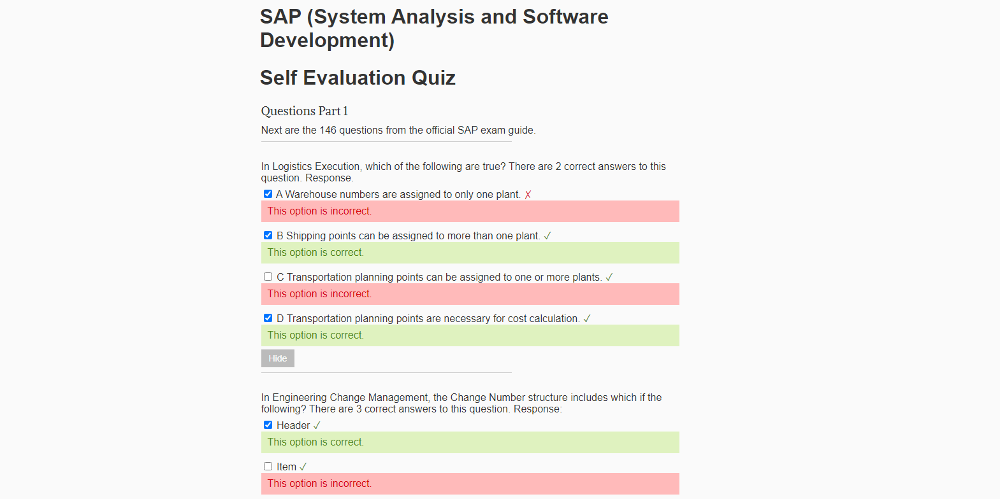

<!-- 
To Add Back To the Top Links

(<a href="#readme-top">back to top</a>)

If a site or webapp add (Explore the site link)

	Site description
	 
	<a href="https://github.com/othneildrew/Best-README-Template"><strong>Explore the docs »</strong></a>
	 

For foldable content like a TOC use 

	
 Table of Contents 

	<ol>
		<li> <a href="#about">About</a>
		<ul>
			<li><a href="#built">Built</a></li>
		</ul>
	</ol>

To add built with after first div add:

	

-->

 

	
	<h3 align="center">SAP Self Evaluation Quiz</h3>
	

    	Template to create self evaluation quizzes.
  	

## About

Simple HTML and CSS quiz template with a design based on the output from [this](https://github.com/karanveerm/quizgen) quiz generator. I used this at my university with other people in order to create self evaluation quizzes that assisted in their studies and helped them obtain better grades. This project had various restrictions such as:

1. It needed to be portable
	1. No installation
	1. Platform independent (HTML file)
	1. Small size (2 small files max)
1. I could customize the questions and answers directly from the html code.
1. It needed to generate colorful feedback for every question
1. Include capability for math rendering (Mathjax) and hints after every submission.

## Installation

1. No installation needed, just open the html file with a browser.

## Usage

Simply edit the HTML file to your particular needs.

 

 
 Example of the feedback provided for each question. 
 

## Roadmap

- [x] Generate simple self evaluation quizzes
- [ ] Add a custom static generator script
    - [ ] Create a version that shows the feedback with a single submission at the end.

## License

Distributed under the [MIT License](https://mit-license.org/).

## Contact

Dario Arzaba - dario.arzaba@gmail.com